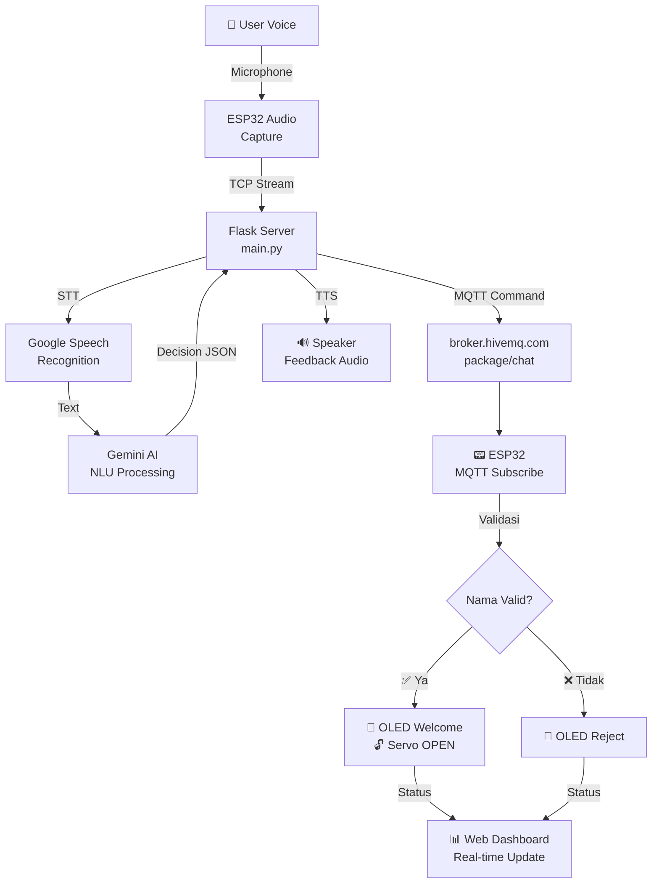

# 📦 Smart Package Box System (ESP32 + MQTT + AI Voice)

Proyek ini adalah sistem kotak paket pintar yang menggunakan ESP32 sebagai *microcontroller* utama, dikoneksikan melalui protokol MQTT untuk menerima perintah suara (STT + Gemini AI) maupun input teks manual.

---

## 🎯 Fitur Utama

- ✅ **Voice-to-Text (STT)**: Deteksi suara menggunakan Google Speech Recognition
- 🤖 **AI Natural Language**: Gemini AI untuk memahami perintah dengan bahasa natural
- 📡 **MQTT Protocol**: Komunikasi real-time antara Python dan ESP32
- 🔐 **Whitelist Security**: Hanya nama terdaftar yang bisa membuka kotak
- 🎨 **OLED Display**: Animasi wajah dan pesan interaktif
- 🔓 **Smart Servo Lock**: Buka/tutup otomatis dengan konfirmasi status
- 📊 **Real-time Dashboard**: Web monitoring dengan MQTT WebSocket
- 🎧 **Text-to-Speech**: Feedback suara natural ke pengguna

---

## 📂 Struktur Folder & Alur Kerja

```
smart-package-box/
├── esp32-firmware/
│   └── sketch.ino                  # Arduino code untuk ESP32
├── pc-server/
│   ├── main.py                     # Flask server + Gemini AI
│   └── requirements.txt            # Python dependencies
├── web-dashboard/
│   ├── index.html                  # Web interface
│   ├── style.css                   # Dark mode styling
│   └── main.js                     # MQTT WebSocket client
├── wiring.md                       # Hardware connection guide
├── DOKUMENTASI.md                  # Full documentation
└── README.md                       # File ini
```

---

## 🔄 Alur Kerja Sistem

### **Flow Diagram**



---

## 🚀 Instalasi & Setup

### **1. Install Dependencies**

```bash
pip install -r pc-server/requirements.txt
```

**requirements.txt:**
```
flask
flask-cors
google-generativeai
python-dotenv
paho-mqtt
SpeechRecognition
pyttsx3
pyaudio
gTTS
```

### **2. Setup Gemini API Key**

Buat file `.env` di folder `pc-server/`:

```env
GEMINI_API_KEY=your_gemini_api_key_here
MQTT_BROKER=broker.hivemq.com
MQTT_PORT=1883
```

Dapatkan API key: [https://makersuite.google.com/app/apikey](https://makersuite.google.com/app/apikey)

### **3. Upload ESP32 Code**

**Option A: Arduino IDE (ESP32 Fisik)**
```cpp
// Buka Arduino IDE
// Tools → Board → ESP32 Dev Module
// Tools → Port → Pilih COM port
// Sketch → Upload

// Update config di sketch.ino:
const char* ssid = "Your-WiFi-SSID";
const char* password = "Your-WiFi-Password";
const char* mqtt_server = "broker.hivemq.com";
```

**Option B: Wokwi Simulator**
```
1. Buka: https://wokwi.com
2. New Project → Blank Sketch
3. Copy code dari esp32-firmware/sketch.ino
4. Click "Start Simulation"
```

### **4. Run PC Server**

```bash
cd pc-server
export GEMINI_API_KEY="your-key-here"  # Linux/Mac
# atau set GEMINI_API_KEY=your-key-here  # Windows
python main.py
```

Output:
```
🚀 Smart Package Box Server aktif!
   Model: gemini-1.5-flash
   MQTT Broker: broker.hivemq.com
   Listening on http://localhost:5000
```

### **5. Open Web Dashboard**

```bash
cd web-dashboard
# Option A: Python server
python -m http.server 8000

# Option B: Live Server (VS Code extension)
# Option C: Deploy ke GitHub Pages
```

Buka di browser: `http://localhost:8000`

---

## 📡 Konfigurasi MQTT

| Parameter | Value |
|-----------|-------|
| **Broker** | `broker.hivemq.com` |
| **Port** | `1883` |
| **Topic Command** (ESP32 Subscribe) | `package/chat` |
| **Topic Status** (ESP32 Publish) | `package/status` |

### **MQTT Command Format**

**Dari Python → ESP32:**
```
name:aisyah     → Buka kotak untuk Aisyah
close_box       → Tutup kotak
ask_name        → Tampilkan "Paket atas nama siapa?"
invalid_name    → Tampilkan "Nama tidak terdaftar"
```

**Dari ESP32 → Python:**
```
opened          → Konfirmasi kotak sudah terbuka
closed          → Konfirmasi kotak sudah tertutup
```

---

## 🔐 Whitelist Security

Nama-nama yang terdaftar (case-insensitive):
- ✅ `aisyah`
- ✅ `rabiathul`
- ✅ `nadia`

Gemini AI dapat memahami variasi seperti:
- "Paket untuk Aisyah"
- "Ini buat Mbak Nadia"
- "Aisyah aja"
- "Saya Rabiathul"

---

## 🎮 Testing & Demo

### **Skenario 1: Success Case ✅**

```
Waktu: 10:30 AM
─────────────────────────────────────
🤖 ESP32: Boot → OLED: "Ready"
👤 User: Menekan button mikrofon
🎧 Server: Mendengarkan...
👤 User: "Paket untuk Aisyah"
🔤 STT: "paket untuk aisyah"
🤖 Gemini: {name: "aisyah", valid: true}
📡 MQTT: name:aisyah → ESP32
📟 ESP32: Validasi whitelist → SUCCESS
🎨 OLED: "Selamat! Paket untuk Aisyah"
🔓 Servo: OPEN (0°)
📊 Dashboard: Status = "opened"
🔊 TTS: "Kotak sudah terbuka"
```

### **Skenario 2: Invalid Name ❌**

```
Waktu: 10:35 AM
─────────────────────────────────────
👤 User: "Paket untuk Budi"
🔤 STT: "paket untuk budi"
🤖 Gemini: {name: "budi", valid: false}
📡 MQTT: invalid_name → ESP32
🎨 OLED: "❌ Nama Tidak Terdaftar"
📊 Dashboard: Status = "rejected"
🔊 TTS: "Maaf, nama tidak terdaftar"
```

### **Skenario 3: Timeout ⏱️**

```
Waktu: 10:40 AM
─────────────────────────────────────
🤖 ESP32: Listening...
⏰ 10 detik berlalu... (no input)
🔊 TTS: "Maaf tidak dengar, bisa diulangi?"
📊 Dashboard: Status = "timeout"
```

---

## 🛠️ Hardware Components

### **ESP32 Pinout**

```cpp
// I2C (OLED Display)
I2C_SCL = GPIO 22
I2C_SDA = GPIO 21

// I2S (Audio Streaming)
I2S_BCLK = GPIO 26
I2S_DOUT = GPIO 25
I2S_LRC = GPIO 27

// PWM (Servo Motor)
SERVO_PIN = GPIO 19

// SPI (optional)
SPI_MOSI = GPIO 23
SPI_CLK = GPIO 18
```

### **Komponen yang Diperlukan**

- 1x ESP32 DevKit v1
- 1x INMP441 I2S Microphone
- 1x MAX98357A Speaker Amplifier
- 1x SSD1306 OLED Display 128x64 (I2C)
- 1x SG90 Servo Motor
- Breadboard, jumper wires, power supply

---

## 🐛 Troubleshooting

### **ESP32 tidak konek WiFi**
```cpp
// Debug: Cek SSID & password
Serial.println(WiFi.SSID());

// Pastikan menggunakan 2.4GHz network (bukan 5GHz)
// Jika masalah terus: reset ESP32 dengan menekan tombol RESET
```

### **MQTT tidak publish/subscribe**
```python
# Cek koneksi MQTT di main.py
client.on_connect = on_connect
client.on_message = on_message

# Pastikan broker online
# Test dengan: mosquitto_sub -h broker.hivemq.com -t package/#
```

### **Audio kualitas buruk**
```cpp
// Kurangi sample rate atau duration
const int AUDIO_SAMPLE_RATE = 16000;  // default: 16000
const int AUDIO_DURATION_MS = 3000;   // 3 detik recording
```

### **Servo tidak bergerak**
```cpp
// Cek duty cycle
servo.write(0);     // OPEN
servo.write(180);   // CLOSE

// Atau menggunakan duty cycle langsung
ledcWrite(SERVO_CHANNEL, 26);   // ~0°
ledcWrite(SERVO_CHANNEL, 123);  // ~180°
```

### **STT/TTS tidak bekerja**
```bash
# Windows: Install PyAudio
pip install pipwin
pipwin install pyaudio

# Linux: Install dependencies
sudo apt-get install portaudio19-dev
pip install pyaudio

# Mac: 
brew install portaudio
pip install pyaudio
```

### **Dashboard tidak update real-time**
```javascript
// Cek MQTT WebSocket connection di main.js
console.log("MQTT Status:", client.isConnected());

// Pastikan broker mendukung WebSocket (port 8081 atau 8883)
const MQTT_BROKER_URL = 'wss://test.mosquitto.org:8081';
```

---

## 🎨 Design System

**Color Scheme:**
- 🔵 Primary Blue: `#0066ff`
- 🔷 Accent Cyan: `#00d9ff`
- 🌙 Dark BG: `#0f172a`
- ✅ Success: `#10b981`
- ❌ Error: `#ef4444`

**Typography:**
- Font: System fonts untuk performa
- Heading: Bold 1.25rem
- Body: Regular 1rem
- Mono: 0.875rem untuk timestamps

---

## 📚 Dependencies

### **ESP32 Libraries**
```cpp
#include <WiFi.h>
#include <PubSubClient.h>          // MQTT
#include <driver/i2s.h>            // Audio I2S
#include <Adafruit_SSD1306.h>      // OLED
#include <Adafruit_GFX.h>
#include <ESP32Servo.h>            // Servo
#include <ArduinoJson.h>           // JSON parsing
```

### **PC Server (Python 3.8+)**
```
Flask==2.3.0
flask-cors==4.0.0
google-generativeai==0.3.0
python-dotenv==1.0.0
paho-mqtt==1.6.1
SpeechRecognition==3.10.0
pyttsx3==2.90
gTTS==2.4.0
pyaudio==0.2.11
```

### **Web Dashboard**
```javascript
// Paho MQTT JavaScript client (included via CDN)
<script src="https://cdnjs.cloudflare.com/ajax/libs/paho-mqtt/1.1.0/mqttws31.min.js"></script>
```

---

## 🚀 Next Steps / Roadmap

- [ ] Database integration untuk dynamic whitelist
- [ ] Face recognition dengan ESP32-CAM
- [ ] Multiple device support
- [ ] Mobile app (React Native)
- [ ] RFID card authentication
- [ ] Notification via Telegram/WhatsApp
- [ ] Analytics & logging
- [ ] Multi-language support

---

## 📖 Dokumentasi Lengkap

- **Full Documentation**: Lihat `DOKUMENTASI.md`
- **Hardware Setup**: Lihat `wiring.md`
- **Code Comments**: Lihat komentar di dalam source files

---

## 🤝 Contributing

Contributions sangat diterima! Please:

1. Fork repository ini
2. Create feature branch (`git checkout -b feature/amazing-feature`)
3. Commit changes (`git commit -m 'Add amazing feature'`)
4. Push to branch (`git push origin feature/amazing-feature`)
5. Open Pull Request

---

## 📄 License

MIT License - bebas digunakan untuk proyek komersial maupun personal

---

## 🙋 Support & Help

- Buat issue di GitHub untuk bugs/questions
- Lihat section Troubleshooting di atas
- Review dokumentasi lengkap di `DOKUMENTASI.md`

---

**Dibuat dengan ❤️ untuk memudahkan delivery paket yang cerdas dan aman.**

💡 *Smart Package. Smart Delivery. Smart Future.*
