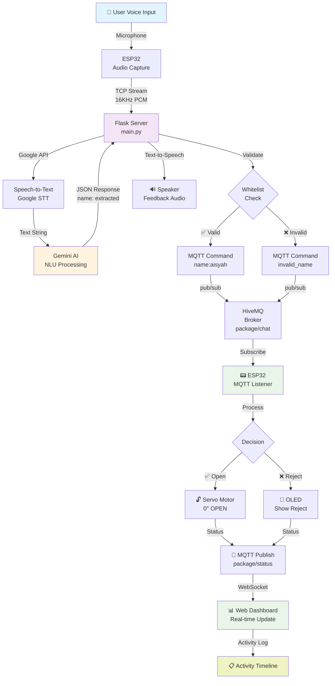
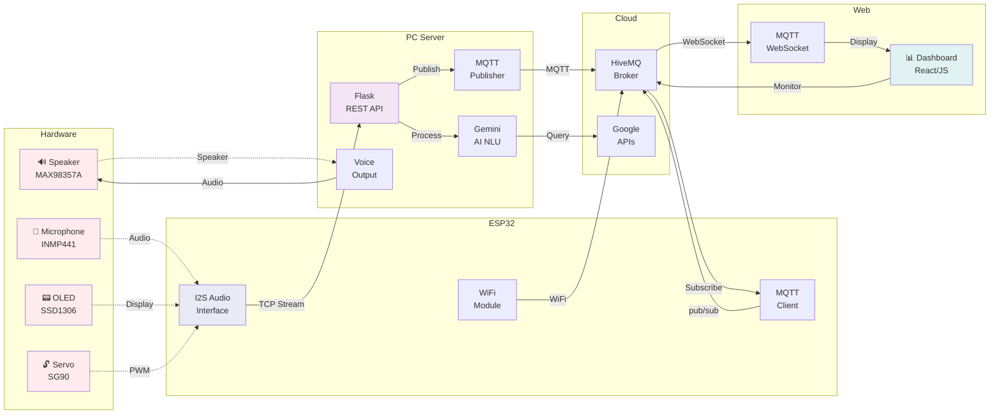
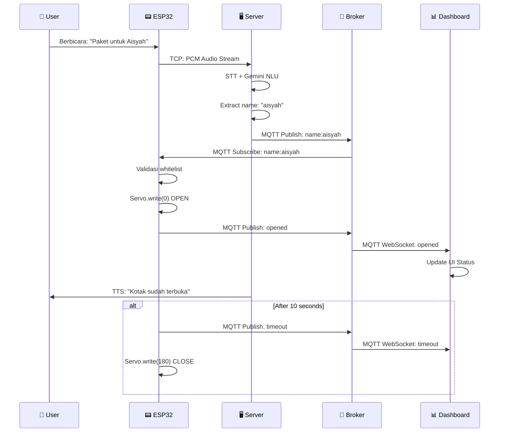
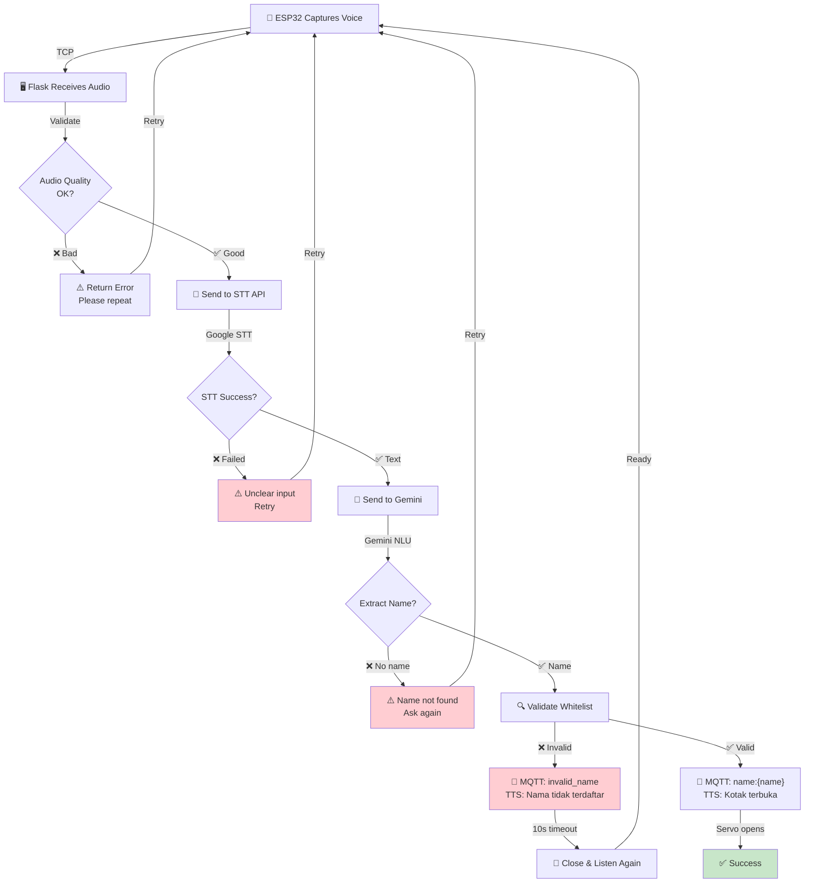
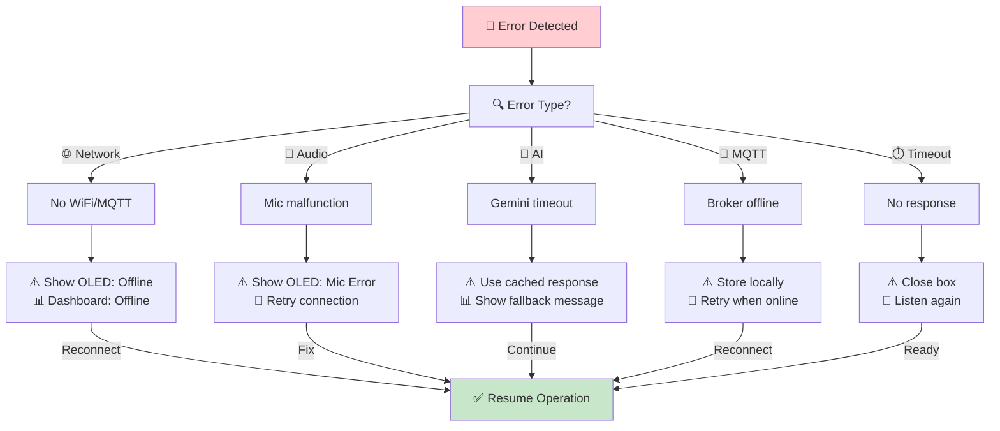

<h1 align="center"> Smart Package Box System 📦🔐🤖

<p align="center">
  
  
  
  
  
</p>


<h2 align="center"> 🎯 Overview
<p align="center">
Smart Package Box System adalah sistem kotak paket pintar berbasis IoT yang mengintegrasikan **ESP32**, **Python Flask**, dan **Gemini AI** untuk manajemen pengiriman paket yang aman dan cerdas. Sistem ini menggunakan voice recognition (STT), AI natural language processing (NLU), dan protocol MQTT untuk komunikasi real-time. Pengguna dapat membuka kotak hanya dengan menyebutkan nama mereka, yang divalidasi oleh AI dan whitelist security system.
</p>

## ✨ Fitur Utama

### 🎤 Voice & AI Features
- **Voice-to-Text (STT)** - Deteksi suara real-time menggunakan Google Speech Recognition
- **Gemini AI Natural Language** - Pemahaman perintah dengan AI untuk ekstraksi nama dan Intent dari input suara
- **Intelligent Name Extraction** - AI memahami variasi bahasa seperti "Paket untuk Aisyah", "Ini buat Mbak Nadia", dll
- **Text-to-Speech (TTS)** - Feedback suara natural ke pengguna dengan respons dinamis

### 📡 IoT & Communication
- **MQTT Protocol** - Komunikasi real-time antara Python dan ESP32 via broker HiveMQ
- **TCP Audio Streaming** - Transmisi audio raw dari ESP32 ke Python server
- **WebSocket MQTT** - Web dashboard terhubung real-time dengan IoT device
- **I2S Audio Interface** - Audio input dari INMP441 microphone dan output ke MAX98357A speaker

### 🔐 Security & Control
- **Whitelist Security System** - Hanya nama terdaftar yang bisa membuka kotak
- **Smart Servo Lock** - Servo motor otomatis untuk open/close dengan validasi
- **Status Confirmation** - Konfirmasi dual-direction MQTT untuk state management
- **Case-Insensitive Matching** - Nama dapat ditulis dalam berbagai format

### 🎨 User Interface
- **OLED Display** - Animasi wajah interaktif di LCD 128x64 (SSD1306)
- **Real-time Web Dashboard** - Monitoring status paket dengan update live
- **Dark Mode UI** - Interface modern dengan color scheme biru-cyan
- **Activity Logging** - Riwayat semua akses dan status perubahan

### 📊 System Monitoring
- **Health Status Check** - Monitor status AI, MQTT, dan komponen lainnya
- **Real-time Logging** - Timeline lengkap setiap transaksi
- **Performance Metrics** - Tracking response time dan success rate
- **System Analytics** - Data untuk improvement dan optimization

## 📋 Requirements

### Hardware Development
- ESP32 DevKit v1
- INMP441 I2S Microphone
- MAX98357A Speaker Amplifier
- SSD1306 OLED Display 128x64 (I2C)
- SG90 Servo Motor
- Breadboard, jumper wires, power supply 5V/2A
- USB Cable untuk programming

### Backend Development
- Python 3.8+
- Google Gemini API key (untuk AI processing)
- MQTT Broker (HiveMQ atau mosquitto)
- Flask framework untuk REST API
- Virtual environment (recommended)

### Frontend Development
- Web browser modern (Chrome, Firefox, Safari)
- Internet connection untuk MQTT WebSocket
- CDN access untuk Paho MQTT library

### Dependencies

```bash
# Python Backend Dependencies
Flask==2.3.0
flask-cors==4.0.0
google-generativeai==0.3.0
python-dotenv==1.0.0
paho-mqtt==1.6.1
SpeechRecognition==3.10.0
pyttsx3==2.90
gTTS==2.4.0
pyaudio==0.2.11
requests==2.31.0

# ESP32 Libraries (Arduino IDE)
WiFi.h
PubSubClient (MQTT)
driver/i2s.h (Audio)
Adafruit_SSD1306.h (OLED)
Adafruit_GFX.h
ESP32Servo.h
ArduinoJson.h
```

## 🚀 Installation

### 1. Clone & Setup Repository
```bash
git clone https://github.com/your-repo/smart-package-box.git
cd smart-package-box
```

### 2. Backend Setup (Python Server)

#### Install Dependencies
```bash
# Create virtual environment
python -m venv venv

# Activate virtual environment
# Windows:
venv\Scripts\activate
# macOS/Linux:
source venv/bin/activate

# Install packages
cd pc-server
pip install -r requirements.txt
```

#### Configure Environment
Create `.env` file in `pc-server/` directory:
```env
GEMINI_API_KEY=your_gemini_api_key_here
GEMINI_MODEL=gemini-1.5-flash
FLASK_DEBUG=True
MQTT_BROKER=broker.hivemq.com
MQTT_PORT=1883
FLASK_PORT=5000

# Optional: Whitelist names (comma-separated)
WHITELIST_NAMES=aisyah,rabiathul,nadia
```

Get Gemini API key from: https://makersuite.google.com/app/apikey

#### Run Flask Server
```bash
python main.py
```

Expected output:
```
🚀 Smart Package Box Server aktif!
   Model: gemini-1.5-flash
   MQTT Broker: broker.hivemq.com
   Listening on http://localhost:5000
```

### 3. Hardware Setup (ESP32)

#### Hardware Wiring
```cpp
// I2C (OLED Display - SSD1306)
I2C_SCL = GPIO 22
I2C_SDA = GPIO 21

// I2S (Audio - Microphone & Speaker)
I2S_BCLK = GPIO 26
I2S_DOUT = GPIO 25  // Speaker output
I2S_LRC = GPIO 27

// PWM (Servo Motor)
SERVO_PIN = GPIO 19

// SPI (optional for future expansion)
SPI_MOSI = GPIO 23
SPI_CLK = GPIO 18
```

#### Configure ESP32 Code
Edit `esp32-firmware/sketch.ino`:
```cpp
const char* ssid = "Your-WiFi-SSID";
const char* password = "Your-WiFi-Password";
const char* mqtt_server = "broker.hivemq.com";
const int mqtt_port = 1883;

// TCP Server untuk audio streaming
const int tcp_port = 9999;
const char* tcp_host = "192.168.1.100";  // IP address PC Server
```

#### Upload to ESP32
**Option A: Arduino IDE**
```
1. Install ESP32 Board: Arduino IDE → Preferences → Additional Boards Manager URLs
2. Add: https://raw.githubusercontent.com/espressif/arduino-esp32/gh-pages/package_esp32_index.json
3. Tools → Board Manager → Search "ESP32" → Install
4. Tools → Board → ESP32 Dev Module
5. Select COM port → Upload sketch
```

**Option B: Web-based (Wokwi Simulator)**
```
1. Visit: https://wokwi.com
2. Create new project → Paste sketch.ino code
3. Click "Start Simulation"
```

### 4. Web Dashboard Setup

#### Run Dashboard Locally
```bash
cd web-dashboard

# Option A: Python server
python -m http.server 8000

# Option B: Node.js (if installed)
npx http-server

# Option C: Live Server (VS Code extension)
# Right-click index.html → Open with Live Server
```

Open browser: `http://localhost:8000`

#### Deploy to GitHub Pages
```bash
# Create gh-pages branch
git checkout --orphan gh-pages

# Add files
git add .
git commit -m "Deploy web dashboard"

# Push to GitHub
git push origin gh-pages
```

Then enable in GitHub Settings → Pages → Deploy from gh-pages branch

---

## 📈 System Architecture

### System Flow Diagram



### Component Interaction Diagram



---

## 📡 MQTT Configuration

### Broker Settings
| Parameter | Value | Purpose |
|-----------|-------|---------|
| **Broker URL** | `broker.hivemq.com` | Free MQTT broker |
| **Port** | `1883` | Standard MQTT |
| **WebSocket Port** | `8000` | For web dashboard |
| **Protocol** | `MQTT v3.1.1` | Connection protocol |

### MQTT Topics

#### Published Topics (ESP32 → Server → Dashboard)
```
package/status
├── opened         → Kotak terbuka (servo success)
├── closed         → Kotak tertutup (manual close)
├── rejected       → Nama tidak valid
└── timeout        → Timeout listening
```

#### Subscribed Topics (Server → ESP32)
```
package/chat
├── name:{name}    → Buka kotak untuk {name}
├── close_box      → Tutup kotak
├── ask_name       → Prompt "Paket atas nama siapa?"
└── invalid_name   → Tampilkan "Nama tidak terdaftar"
```

### MQTT Message Flow



---

## 🎯 API Endpoints

### 🔐 Authentication & Status
- `GET /health` - System health check
  - Response: `{status: ok, ai_status: online, mqtt_status: connected, timestamp}`
  
- `POST /api/test-connection` - Test API connectivity
  - Response: `{success: true, message: "Connected"}`

### 🎤 Voice & AI Processing
- `POST /api/process-voice` - Process voice command
  - Body: `{user_id, audio_buffer, duration_ms}`
  - Response: `{success, name_extracted, confidence, action}`

- `POST /api/process-text` - Process text command
  - Body: `{user_id, text_input}`
  - Response: `{success, name_extracted, confidence}`

- `GET /api/list-models` - List available AI models
  - Response: `{success, models: [gemini-1.5-flash, gemini-pro, ...]}`

### 📦 Box Control
- `POST /api/open-box` - Manual open command
  - Body: `{user_id, reason}`
  - Response: `{success, message}`

- `POST /api/close-box` - Manual close command
  - Body: `{user_id}`
  - Response: `{success, message}`

- `GET /api/box-status` - Get current box status
  - Response: `{status: opened/closed, last_action, last_user}`

### 📊 Dashboard & Analytics
- `GET /api/activity-log` - Get activity history
  - Response: `{success, logs: [{timestamp, action, user_name, status}]}`

- `GET /api/statistics` - Get system statistics
  - Response: `{success_rate, avg_response_time, total_transactions}`

---

## 🔄 API Flow & Error Handling

### Voice Processing Flow



### Error Handling Strategy



---

## 🎮 Testing & Scenarios

### Skenario 1: Success Case ✅

```
Timestamp: 10:30:45 AM
─────────────────────────────────────────────
📟 ESP32: Boot completed
📟 OLED: Display "Ready for voice input..."
👤 User: Menekan tombol mikrofon
🎧 Server: Listening...
👤 User: "Paket untuk Aisyah"

🔄 Processing:
  🔤 STT: "paket untuk aisyah"
  🤖 Gemini: {name: "aisyah", confidence: 0.98}
  🔍 Whitelist: ✅ VALID
  📡 MQTT: Publish "name:aisyah" to package/chat
  
✅ Result:
  📟 OLED: "✅ Selamat Datang! Paket untuk Aisyah"
  🔓 Servo: 0° (OPEN)
  📊 Dashboard: Status = "opened"
  🔊 Speaker: "Kotak sudah terbuka untuk Aisyah"
  📋 Log: "2024-01-15 10:30:45 | OPENED | Aisyah | Success"
```

### Skenario 2: Invalid Name ❌

```
Timestamp: 10:35:20 AM
─────────────────────────────────────────────
👤 User: "Paket untuk Budi"

🔄 Processing:
  🔤 STT: "paket untuk budi"
  🤖 Gemini: {name: "budi", confidence: 0.95}
  🔍 Whitelist: ❌ NOT FOUND
  📡 MQTT: Publish "invalid_name" to package/chat

❌ Result:
  📟 OLED: "❌ Nama tidak terdaftar. Coba lagi!"
  📊 Dashboard: Status = "rejected"
  🔊 Speaker: "Maaf, nama tidak terdaftar dalam sistem"
  📋 Log: "2024-01-15 10:35:20 | REJECTED | Budi | Not in whitelist"
  ⏰ Auto close: Servo 180° (CLOSE) after 10s
```

### Skenario 3: Timeout ⏱️

```
Timestamp: 10:40:00 AM
─────────────────────────────────────────────
📟 ESP32: Listening mode activated
👤 User: (tidak berbicara dalam 10 detik)

⏰ Timeout triggered:
  📡 MQTT: Publish "timeout" to package/chat
  
⏰ Result:
  📟 OLED: "⏰ Tidak ada input. Dengarkan ulang..."
  📊 Dashboard: Status = "timeout"
  🔊 Speaker: "Maaf tidak dengar, silakan coba ulangi"
  🔓 Servo: 180° (CLOSE) - ensure box closed
  📋 Log: "2024-01-15 10:40:15 | TIMEOUT | No input | Auto close"
  🔄 Ready untuk voice input berikutnya
```

### Skenario 4: Network Disconnection 🌐

```
Timestamp: 10:45:30 AM
─────────────────────────────────────────────
🌐 WiFi/MQTT disconnected

🔄 Fallback behavior:
  📟 OLED: "📡 Connection Lost..."
  📊 Dashboard: "⚠️ OFFLINE"
  🎤 Microphone: Still operational (local processing)
  🔄 Auto-reconnect: Retry every 5 seconds
  💾 Queue: Store commands locally
  
✅ When reconnected:
  🔄 Sync queued commands to server
  📊 Dashboard: Updates with queued actions
  📟 OLED: "✅ Connection Restored"
```

---

## 📊 Design System & UI

### Color Palette
```css
/* Primary Colors */
--primary-blue: #0066ff       /* Main brand color */
--accent-cyan: #00d9ff        /* Accent & highlights */

/* Neutral Colors */
--bg-dark: #0f172a            /* Dark background */
--bg-darker: #0a0f1f          /* Darker background */
--text-primary: #ffffff       /* Primary text */
--text-secondary: #a0aec0     /* Secondary text */
--border-color: #1a2332       /* Border color */

/* Status Colors */
--success-green: #10b981      /* Success/opened */
--error-red: #ef4444          /* Error/rejected */
--warning-yellow: #f59e0b     /* Warning */
--info-blue: #3b82f6          /* Info messages */
```

### Typography
```css
/* Headings */
font-family: -apple-system, BlinkMacSystemFont, 'Segoe UI', sans-serif;
font-weight: 600 (bold);
font-size: 1.25rem;
line-height: 1.5;

/* Body Text */
font-size: 1rem;
font-weight: 400;
line-height: 1.6;

/* Monospace */
font-family: 'Courier New', monospace;
font-size: 0.875rem;
```

### Component Styles
```css
/* Cards */
background: rgba(30, 41, 59, 0.8);
border: 1px solid rgba(0, 217, 255, 0.1);
border-radius: 8px;
padding: 1rem;

/* Buttons */
background: linear-gradient(135deg, #0066ff, #00b4ff);
color: white;
padding: 0.75rem 1.5rem;
border-radius: 6px;
```

---

## 🛠️ Hardware Specifications

### Microcontroller
- **Model**: ESP32-WROOM-32
- **RAM**: 520 KB
- **Flash**: 4 MB
- **WiFi**: 802.11 b/g/n
- **Bluetooth**: v4.2
- **Operating Voltage**: 3.3V
- **GPIO Pins**: 34 (digital I/O)

### Audio Components
- **Microphone**: INMP441 I2S Digital Microphone
  - Frequency Response: 60Hz - 20kHz
  - THD: <1%
  - Sensitivity: -38 dBFS
  
- **Amplifier**: MAX98357A I2S Audio Amplifier
  - Output Power: 3.2W @ 4Ω
  - Frequency Response: 20Hz - 20kHz
  - Supply Voltage: 3.5V - 5.5V

- **Speaker**: 3W 4Ω Speaker
  - Frequency Range: 100Hz - 20kHz
  - Impedance: 4Ω

### Display & Servo
- **Display**: SSD1306 OLED 128x64
  - Interface: I2C
  - Color: White on Black
  - Contrast: Excellent visibility
  
- **Servo**: SG90 Digital Servo
  - Torque: 2.5kg @ 6V
  - Speed: 0.12 sec/60° @ 6V
  - Operating Voltage: 4.8V - 6V
  - Rotation Range: 0° - 180°

---

## 🐛 Troubleshooting Guide

### WiFi Connection Issues
```cpp
// Problem: ESP32 cannot connect to WiFi
// Solution 1: Verify WiFi credentials
Serial.println("SSID: " + String(ssid));
Serial.println("Signal Strength: " + String(WiFi.RSSI()));

// Solution 2: Restart WiFi module
WiFi.disconnect();
delay(2000);
WiFi.begin(ssid, password);

// Solution 3: Use 2.4GHz network (ESP32 doesn't support 5GHz)
// Check your router settings
```

### MQTT Connection Failed
```python
# Problem: Cannot connect to HiveMQ broker
# Solution 1: Verify broker connectivity
import paho.mqtt.client as mqtt
client = mqtt.Client()
client.connect("broker.hivemq.com", 1883, 60)
client.loop_forever()

# Solution 2: Check firewall/proxy settings
# Solution 3: Test with mosquitto_pub tool
# mosquitto_pub -h broker.hivemq.com -t "package/test" -m "hello"
```

### Audio Quality Problems
```cpp
// Problem: Audio too noisy or distorted
// Solution 1: Adjust I2S settings
const int AUDIO_SAMPLE_RATE = 16000;  // Default: 16000 Hz
const int AUDIO_DURATION_MS = 3000;   // Duration: 3 seconds
const int AUDIO_BITS = 16;            // 16-bit audio

// Solution 2: Add microphone amplification
// Adjust INMP441 sensitivity settings

// Solution 3: Check microphone wiring
// Ensure I2S pins are correctly connected
```

### Servo Motor Not Responding
```cpp
// Problem: Servo doesn't move
// Solution 1: Test servo directly
servo.write(0);     // Should move to 0°
delay(500);
servo.write(180);   // Should move to 180°

// Solution 2: Check PWM signal
// Use oscilloscope to verify PWM on SERVO_PIN

// Solution 3: Verify power supply
// Servo needs 5V with sufficient current (>1A)

// Solution 4: Check servo range limits
ledcWrite(SERVO_CHANNEL, 26);   // ~0° (OPEN)
ledcWrite(SERVO_CHANNEL, 123);  // ~180° (CLOSE)
```

### STT/TTS Errors
```bash
# Problem: Speech recognition not working
# Solution 1: Install PyAudio dependencies

# Windows:
pip install pipwin
pipwin install pyaudio

# Linux:
sudo apt-get install portaudio19-dev python3-all-dev
pip install pyaudio

# Mac:
brew install portaudio
pip install pyaudio

# Solution 2: Check microphone permissions
# Allow microphone access in System Settings
```

### Dashboard Not Updating
```javascript
// Problem: Real-time updates not showing
// Solution 1: Verify MQTT WebSocket connection
console.log("MQTT Connected:", client.isConnected());

// Solution 2: Check topic subscriptions
client.subscribe("package/status");
client.subscribe("package/chat");

// Solution 3: Verify broker WebSocket port
const MQTT_BROKER_URL = 'wss://broker.hivemq.com:8001';  // Updated port

// Solution 4: Check browser console for errors
// Open DevTools → Console tab
```

### API Timeouts
```python
# Problem: Flask API requests timing out
# Solution 1: Increase timeout values
import requests
response = requests.post(url, timeout=30)  # 30 second timeout

# Solution 2: Check Python server is running
# Verify: python main.py output

# Solution 3: Verify network connectivity
# ping localhost:5000
# curl http://localhost:5000/health

# Solution 4: Check resource usage
# Monitor CPU, RAM, disk space
# Use: top, htop, or Task Manager
```

---

## 📚 Dependencies & Versions

### Python Stack
```plaintext
Flask              2.3.0        REST API framework
flask-cors         4.0.0        CORS support
google-generativeai 0.3.0       Gemini AI API
python-dotenv      1.0.0        Environment configuration
paho-mqtt          1.6.1        MQTT protocol
SpeechRecognition  3.10.0       Google STT
pyttsx3            2.90         Text-to-Speech engine
gTTS               2.4.0        Google Text-to-Speech
pyaudio            0.2.11       Audio I/O
requests           2.31.0       HTTP library
