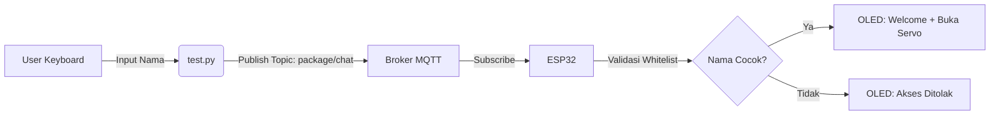
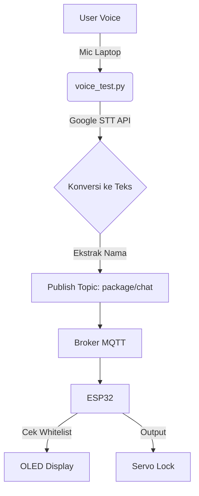

# 📦 Smart Package Box System (ESP32 + MQTT)

Proyek ini adalah sistem kotak paket pintar yang menggunakan ESP32 sebagai *microcontroller* utama, dikoneksikan melalui protokol MQTT untuk menerima perintah suara (STT) maupun input teks manual.

## 📂 Struktur Folder & Alur Kerja

Berikut adalah penjelasan mengenai struktur folder proyek dan diagram alur kerjanya:

### 1. `test/inputname/` (Manual Text Input)
Folder ini berisi skrip Python untuk mensimulasikan input teks manual melalui keyboard yang dikirim ke ESP32 via MQTT.

**Alur Kerja Input Manual:**


### 2. `test/voice_test/` (Voice STT Input)
Folder ini berisi implementasi *Speech-to-Text* (STT) menggunakan library `SpeechRecognition` dan Google STT API di sisi laptop.

**Alur Kerja Input Suara:**


---

## 🚀 Cara Menjalankan

### Persiapan
1. Install dependensi Python:
   ```bash
   pip install paho-mqtt SpeechRecognition PyAudio
   ```
2. Upload kode `main.py` ke ESP32 (atau gunakan simulator Wokwi).

### Menjalankan Pengujian
1. **Mode Teks**: Jalankan `python test/inputname/test.py`. Masukkan nama yang terdaftar (contoh: "aisah").
2. **Mode Suara**: Jalankan `python test/voice_test/voice_test.py`. Ucapkan nama target saat diminta.

---

## 📡 Konfigurasi MQTT
- **Broker**: `broker.hivemq.com`
- **Port**: `1883`
- **Topic In (ESP32)**: `package/chat` (Menerima perintah)
- **Topic Out (ESP32)**: `package/confirm` (Mengirim status)

## 🔐 Keamanan & Whitelist
Sistem ini menggunakan sistem *whitelist* berbasis nama. Nama-nama yang diizinkan meliputi:
- `aisah`, `rabiathul`, `nadiyah`,.

Jika nama tidak terdaftar, ESP32 akan menolak akses dan menampilkan pesan peringatan di layar OLED.
