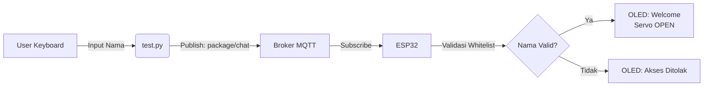
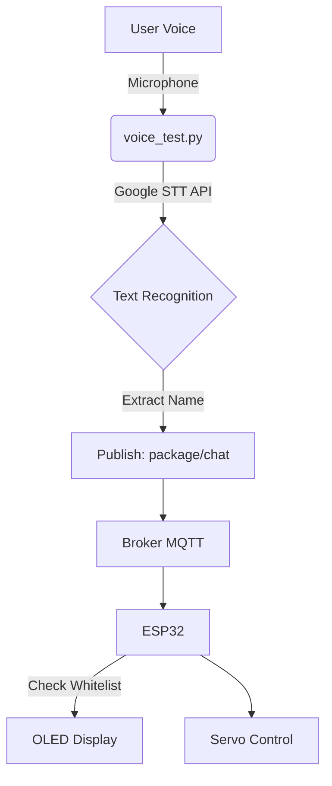
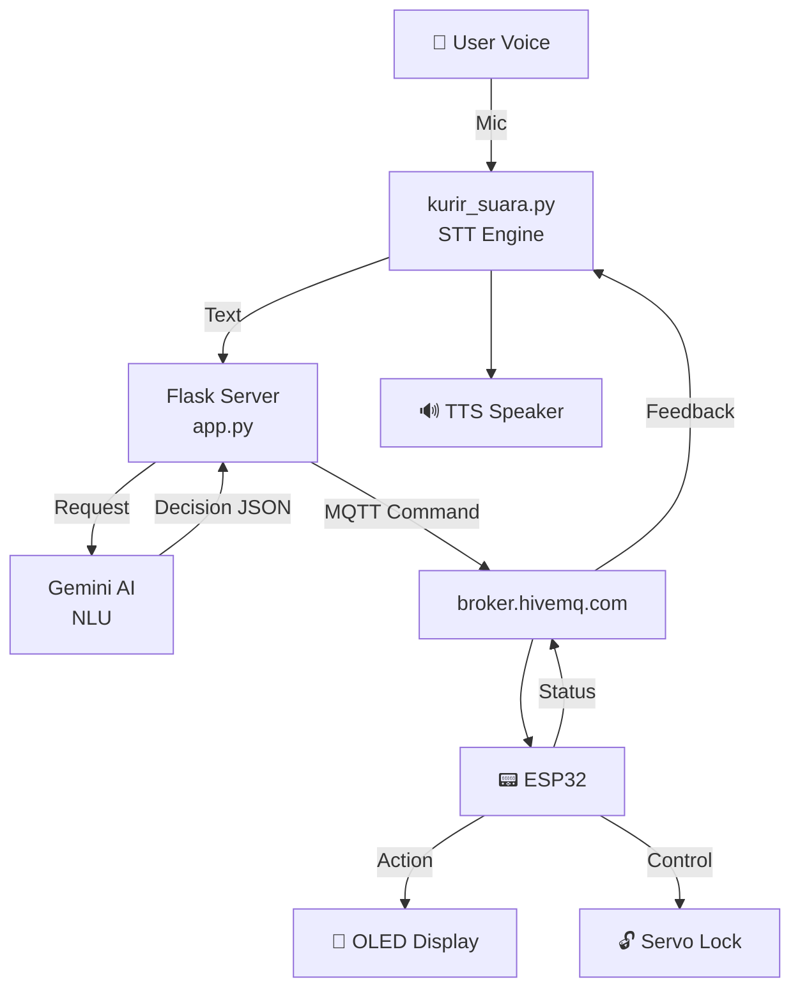

# 📦 Smart Package Box System (ESP32 + MQTT + AI Voice)

Proyek ini adalah sistem kotak paket pintar yang menggunakan ESP32 sebagai *microcontroller* utama, dikoneksikan melalui protokol MQTT untuk menerima perintah suara (STT + Gemini AI) maupun input teks manual.

🔗 **Wokwi Simulator**: [https://wokwi.com/projects/446343184018972673](https://wokwi.com/projects/446343184018972673)

---

## 🎯 Fitur Utama

- ✅ **Voice-to-Text (STT)**: Deteksi suara menggunakan Google Speech Recognition
- 🤖 **AI Natural Language**: Gemini AI untuk memahami perintah dengan bahasa natural
- 📡 **MQTT Protocol**: Komunikasi real-time antara Python dan ESP32
- 🔐 **Whitelist Security**: Hanya nama terdaftar yang bisa membuka kotak
- 🎨 **OLED Display**: Animasi wajah dan pesan interaktif
- 🔓 **Smart Servo Lock**: Buka/tutup otomatis dengan konfirmasi status

---

## 📂 Struktur Folder & Alur Kerja

```
project/
├── test/                         # Testing scripts
│   ├── inputname/
│   │   ├── test.py              # Manual text input via MQTT
│   │   └── wokwi/
│   │       └── main.py          # ESP32 code for text mode
│   │
│   ├── voice_test/
│   │   ├── voice_test.py        # Basic voice STT test
│   │   └── wokwi/
│   │       └── main.py          # ESP32 code for voice mode
│   │
│   └── gemini/
│       ├── app.py               # Flask server with Gemini AI
│       ├── voice_ai.py          # Full voice delivery system
│       ├── wokwi/
│       │   └── main.py          # ESP32 code (latest/production)
│       ├── .env                 # Gemini API key
│       └── requirements.txt     # Python dependencies
│
└── README.md
```

---

## 🔄 Alur Kerja Sistem

### 1. **Mode Input Manual** (`test/inputname/`)
Input teks via keyboard yang langsung dikirim ke ESP32.



**Cara Menjalankan:**
```bash
cd test/inputname
python test.py
# Masukkan: aisyah, rabiathul, atau nadia
```

---

### 2. **Mode Voice Test** (`test/voice_test/`)
STT sederhana tanpa AI, langsung ekstrak nama dari suara.



**Cara Menjalankan:**
```bash
cd test/voice_test
python voice_test.py
# Ucapkan: "Paket untuk Aisyah"
```

---

### 3. **Mode AI Voice (PRODUCTION)** (`test/gemini/`)
Sistem lengkap dengan Gemini AI untuk Natural Language Understanding.



**Flow Detail:**
1. **Kurir berbicara**: "Permisi, paket atas nama siapa?"
2. **User menjawab**: "Aisyah" atau "Paket untuk Nadia"
3. **STT → Flask**: Text dikirim ke endpoint `/package-voice`
4. **Gemini AI analisis**: Ekstrak nama & validasi whitelist
5. **Flask → MQTT**: Kirim command `name:aisyah` ke ESP32
6. **ESP32 action**:
   - ✅ Nama valid → Servo OPEN + OLED welcome
   - ❌ Nama invalid → OLED tolak akses
7. **ESP32 → MQTT**: Kirim status `opened` ke topic `package/status`
8. **Kurir konfirmasi**: "Kotak sudah terbuka, silakan ambil paket"
9. **User ambil paket**: "Sudah selesai"
10. **ESP32**: Servo CLOSE + status `closed`

---

## 🚀 Instalasi & Setup

### 1. Install Dependencies
```bash
pip install -r test/gemini/requirements.txt
```

**requirements.txt:**
```
flask
flask-cors
google-generativeai
python-dotenv
paho-mqtt
SpeechRecognition
pyttsx3
pyaudio
```

### 2. Setup Gemini API Key
Buat file `.env` di folder `test/gemini/`:
```env
GEMINI_API_KEY=your_gemini_api_key_here
```

Dapatkan API key dari: [https://makersuite.google.com/app/apikey](https://makersuite.google.com/app/apikey)

### 3. Upload ESP32 Code
- Buka Wokwi: [https://wokwi.com/projects/446343184018972673](https://wokwi.com/projects/446343184018972673)
- Copy code dari `test/gemini/wokwi/main.py`
- Atau gunakan ESP32 fisik dengan MicroPython

---

## 📡 Konfigurasi MQTT

| Parameter | Value |
|-----------|-------|
| **Broker** | `broker.hivemq.com` |
| **Port** | `1883` |
| **Topic Command** (ESP32 Subscribe) | `package/chat` |
| **Topic Status** (ESP32 Publish) | `package/status` |

### MQTT Command Format

**Dari Python → ESP32:**
- `name:aisyah` → Buka kotak untuk Aisyah
- `close_box` → Tutup kotak
- `ask_name` → Tampilkan "Paket atas nama siapa?"
- `invalid_name` → Tampilkan "Nama tidak terdaftar"

**Dari ESP32 → Python:**
- `opened` → Konfirmasi kotak sudah terbuka
- `closed` → Konfirmasi kotak sudah tertutup

---

## 🔐 Whitelist Security

Nama-nama yang terdaftar (case-insensitive):
- ✅ `aisyah`
- ✅ `rabiathul`
- ✅ `nadia`

**Gemini AI dapat memahami variasi seperti:**
- "Paket untuk Aisyah"
- "Ini buat Mbak Nadia"
- "Aisyah aja"
- "Saya Rabiathul"

---

## 🎮 Cara Menjalankan (Production Mode)

### Terminal 1: Start Flask Server
```bash
cd test/gemini
python app.py
```
Output:
```
🚀 Smart Package Box AI Bridge dengan Gemini aktif!
   Model: gemini-1.5-flash
   Siap menerima suara → analisis → kontrol ESP32
```

### Terminal 2: Start Voice Kurir
```bash
cd test/gemini
python voice_ai.py
```
Output:
```
🚚 Smart Kurir Paket Aktif!
🤖 Kurir: Permisi, ada paket untuk diantar.
🤖 Kurir: Paket ini atas nama siapa ya?
🎧 Mendengarkan...
```

### Terminal 3: Monitor ESP32 (Wokwi)
Buka browser → Start simulation → Lihat Serial Monitor

---

## 🧪 Testing Scenarios

### ✅ Skenario Success
```
Kurir: "Paket atas nama siapa?"
User: "Aisyah"
→ ESP32: Servo OPEN + OLED "Selamat! Paket untuk Aisyah"
→ Status: opened
Kurir: "Kotak sudah terbuka, silakan ambil paket"
Kurir: "Apakah sudah selesai?"
User: "Sudah"
→ ESP32: Servo CLOSE
→ Status: closed
Kurir: "Terima kasih!"
```

### ❌ Skenario Reject
```
Kurir: "Paket atas nama siapa?"
User: "Budi"
→ ESP32: OLED "Nama tidak terdaftar"
Kurir: "Maaf, nama tidak terdaftar"
→ Session end
```

### ⏱️ Skenario Timeout
```
Kurir: "Paket atas nama siapa?"
User: *diam*
→ Timeout 10 detik
Kurir: "Maaf, tidak mendengar. Bisa diulangi?"
```

---

## 🛠️ Troubleshooting

### ESP32 tidak menerima command
```python
# Cek koneksi MQTT di ESP32
print('MQTT Connected:', mqtt_connected)

# Cek topic subscription
mqtt_client.subscribe(MQTT_SUB_TOPIC)
```

### Servo tidak bergerak
```python
# Pastikan duty cycle benar
servo.duty(26)   # OPEN (0°)
servo.duty(123)  # CLOSE (180°)
```

### Voice recognition error
```bash
# Install PyAudio dependencies
# Windows: pip install pipwin && pipwin install pyaudio
# Linux: sudo apt-get install portaudio19-dev python3-pyaudio
# Mac: brew install portaudio && pip install pyaudio
```

### Gemini API error
```python
# Cek API key di .env
load_dotenv()
print(os.getenv('GEMINI_API_KEY'))

# Fallback ke whitelist manual jika Gemini gagal
```

---

## 📊 Hardware Components (ESP32)

- **Microcontroller**: ESP32 DevKit
- **Display**: OLED SSD1306 128x64 (I2C)
- **Actuator**: Servo Motor SG90 (PWM)
- **Communication**: WiFi + MQTT

### Pin Configuration
```python
I2C_SCL = GPIO 22
I2C_SDA = GPIO 21
SERVO_PIN = GPIO 19
```

---

## 🔮 Future Improvements

- [ ] Database integration untuk dynamic whitelist
- [ ] Face recognition dengan ESP32-CAM
- [ ] Multiple delivery tracking
- [ ] Mobile app untuk monitoring
- [ ] RFID card sebagai alternative authentication
- [ ] Notification via Telegram/WhatsApp

---

## 📝 License & Credits

**Author**: Ficrammanifur
**License**: MIT  
**Year**: 2025

**Tech Stack**:
- Python 3.8+
- Flask + Google Gemini AI
- Paho MQTT
- ESP32 MicroPython
- Google Speech Recognition

---

## 🤝 Contributing

Contributions are welcome! Please:
1. Fork this repository
2. Create feature branch (`git checkout -b feature/AmazingFeature`)
3. Commit changes (`git commit -m 'Add some AmazingFeature'`)
4. Push to branch (`git push origin feature/AmazingFeature`)
5. Open Pull Request

---

**Made with ❤️ for Smart Delivery System**
